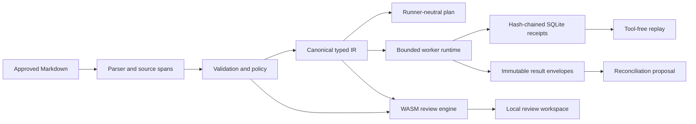

# Architecture

## Crates

| Crate | Responsibility |
| --- | --- |
| `artifact-core` | Format model, parsing, validation, policy, canonical compilation, diffing, and reconciliation |
| `artifact-runtime` | Provider-neutral workers, bounded DAG dispatch, result envelopes, SQLite receipts, and replay |
| `artifact-cli` | Native command surface for the complete workflow |
| `artifact-wasm` | Browser bindings for pure validation and semantic diff functions |
| `artifact-eval` | Deterministic corpus, adversarial, context, conflict, and replay evaluation |

`artifact-runtime` is intentionally absent from WASM. Browser code cannot execute workers, access
SQLite, read secrets, or acquire native capabilities. The browser receives only pure review outputs.

## Data Flow

1. The parser converts front matter, prose sections, and fenced task blocks into typed declarations
   with line spans.
2. Structural validation resolves evidence, input, and dependency references and rejects cycles.
3. Policy validation proves every task capability is a subset of artifact authority and checks
   budgets and gates.
4. Compilation normalizes ordering and computes artifact, task, context, policy, and evidence
   SHA-256 digests.
5. Dispatch constructs each worker request only from declared task inputs, evidence, and authority.
6. Every run transition is appended to a global hash chain in SQLite.
7. Result envelopes are validated against the approved digest and reconciled into a proposal. They
   never edit the approved artifact directly.
